# Path Generation Network
Robot Path Planning via a Path Generation Network.


## Introduction

Planning in configuration space allows us to consider the robot as a single point, thus simplifying the planning problem.

|                          workspace                           |                     configuration space                      |
| :----------------------------------------------------------: | :----------------------------------------------------------: |
| 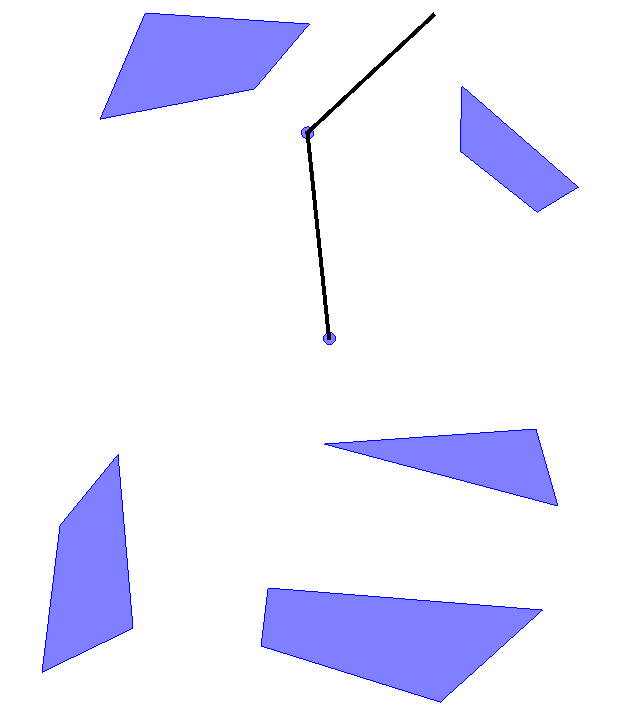 | 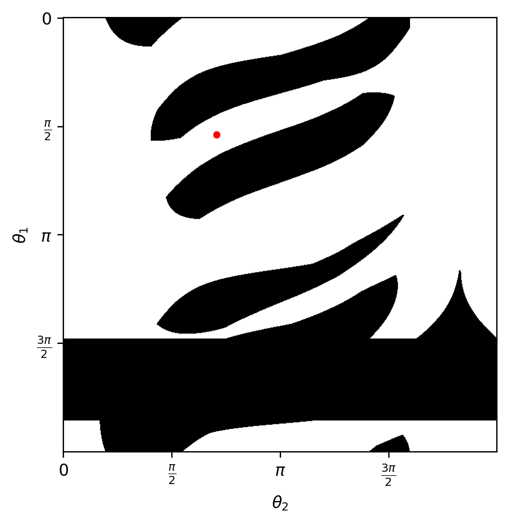 |

|                      path in workspace                       |                 path in configuration space                  |
| :----------------------------------------------------------: | :----------------------------------------------------------: |
| 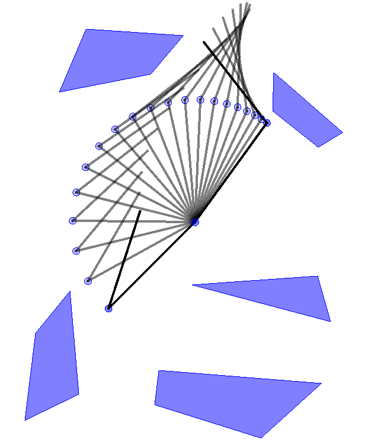 | 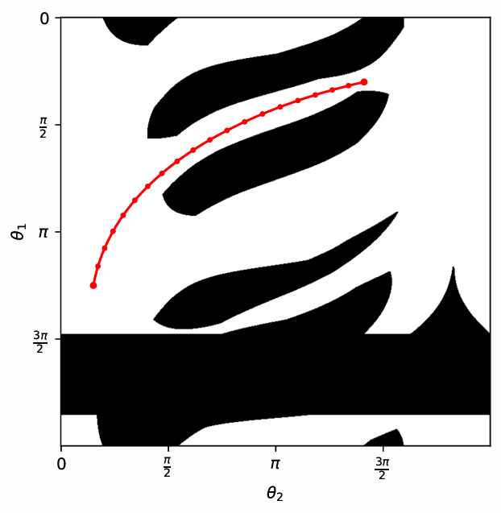 |

However, the conversion from workspace to configuration space usually does not have an explicit mathematical expression, and the configuration space is usually a continuous and high-dimensional space (e.g., a 6-dof robot arm), making it difficult to plan in configuration space.


## Collision Detection Network

Despite its continuity and high dimensionality, given a configuration, we can easily check if it is in the free configuration space. That means, we can sample from that space, and use finite samples to approximate the entire space.  In this repo, whether a robot collides with an obstacle in the environment under configuration $q$ is modelled as the probability of collision. The function $\mathcal{P}(q): q \in \mathcal{Q} \to q \in [0, 1]$ is defined as a mapping from configuration space to probability of collision with the environment.
If the function $\mathcal{P}$ is in the form of a neural network, then its input is the configuration $q \in \mathcal{Q}$, and the output $\mathcal{P}(q)$ is the corresponding collision probability for that configuration. Neural networks are powerful function approximators but require large amounts of labelled data for training, and the configuration space provides just the right amount of training data. 

The network in this repo named Collision Detection Network. Indeed, it is a binary classifier trained with Weighted Cross Entropy:

```math
\mathcal{L} = \frac{1}{N} \sum\limits_{i}{-[w_1 \cdot y_i \cdot \log(p_i) + w_2 \cdot (1 - y_i) \log(1 - p_i)]}
```

where $N$ is the training batch, $w_1$, $w_2$ are the class weights, $p_i$ is the output of $\mathcal{P}$，$y_i$ is the ground truth label provided by geometric collision detection algorithm.

* Network Input: Robot Configuration + Variable (e.g. the information on the dimensions (bbox) of the object being grasped by the robot)
* Network output: The probability of collision with the environment


After training the Collision Detection Network, we can visualize its outputs in two ways:

* make configuration fixed, and change the bbox size

|                 configuration in free space                  |                   probability in bbox size                   |
| :----------------------------------------------------------: | :----------------------------------------------------------: |
| 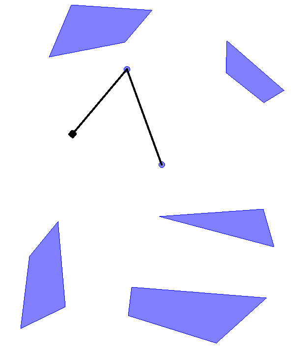 | 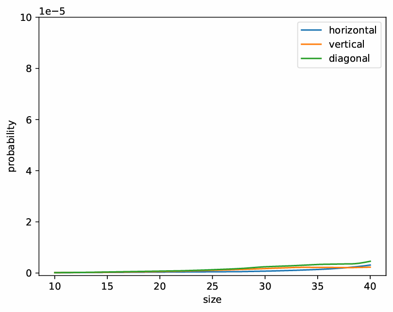 |

|                 configuration near obstacle                  |                   probability in bbox size                   |
| :----------------------------------------------------------: | :----------------------------------------------------------: |
| 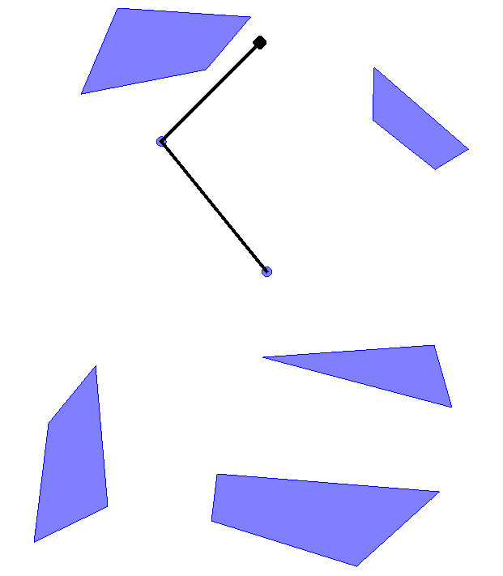 | 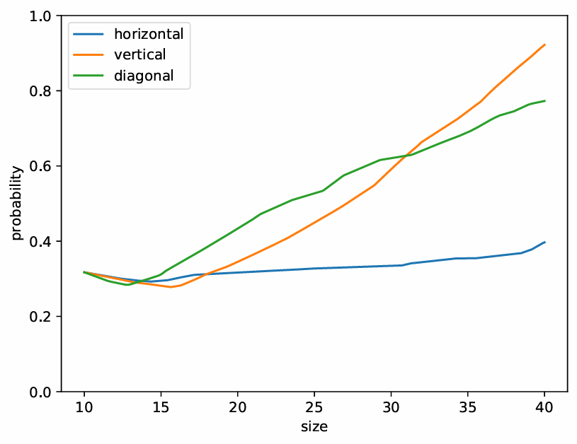 |

* make bbox size fixed, and change the configuration

|               ground truth configuration space               |            network predicted configuration space             |
| :----------------------------------------------------------: | :----------------------------------------------------------: |
| 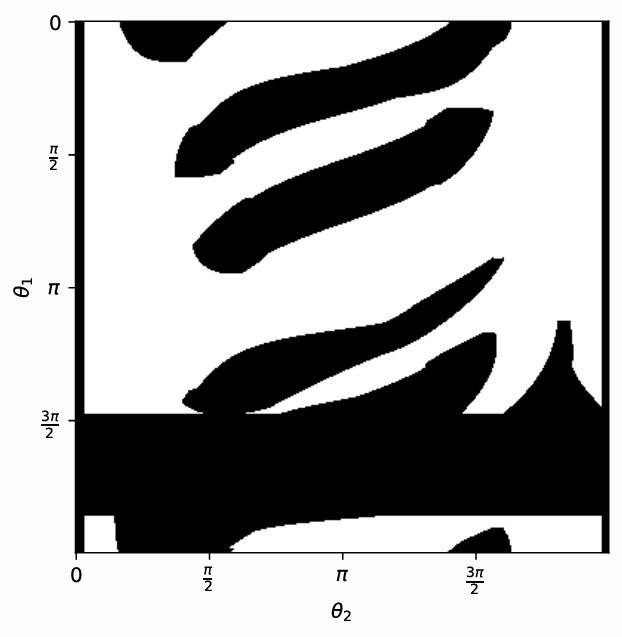 | 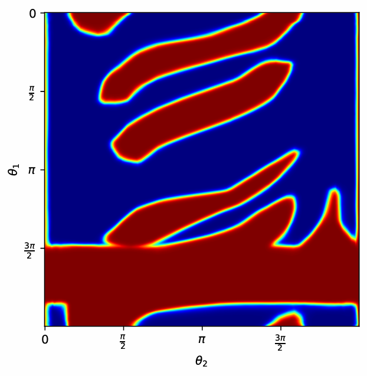 |


## Path Generation Network

### Collision Avoidance

Given a configuration $q$, we can define an objective function:

```math
\mathcal{L} = -\eta\log {[1 - \mathcal{P}(q, \textup{bbox})]}
```

which is, the negative log-likelihood of the robot not colliding with the environment. By minimizing the objective function, configuration $q$ can avoid obstacles:

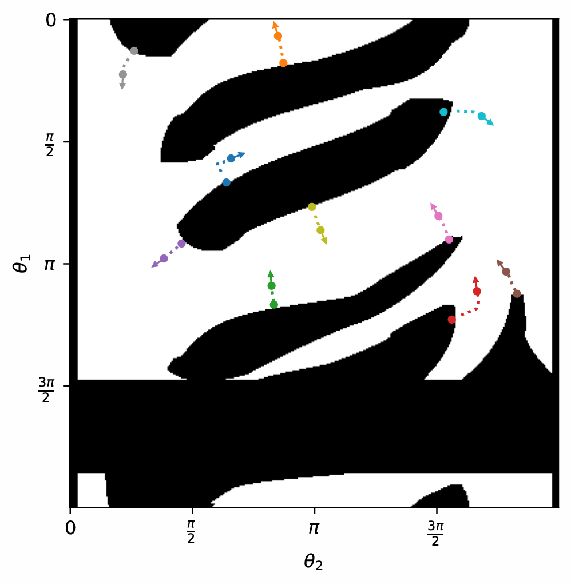

If these independent configurations are constrained to a single curve, then the curve is hopefully capable of achieving overall obstacle avoidance. Instead of adding constrains to each points, we can use Bézier curve, and sample configurations on the curve. At this point the decision variable becomes the control point of the Bézier curve. The below figures shows curves before/after optimization:

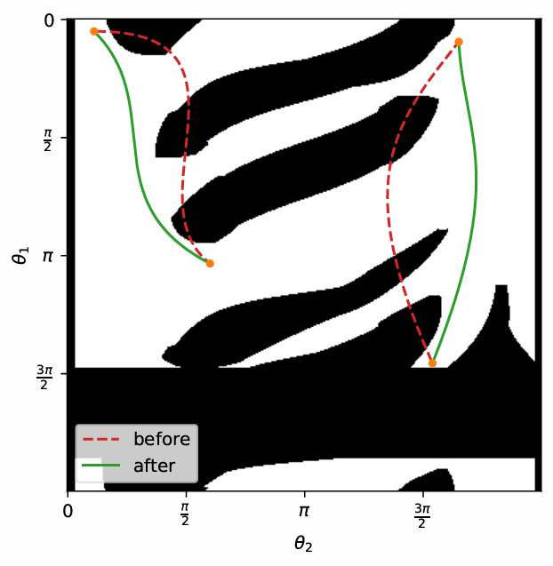

This is actually perfectly fine as a simple path planning algorithm, but for tasks like Pick & Place, where the environment of the robot is fixed and only the dimensions of the object being grasped change, there exists a mapping from planning queries ($q_\textup{init}$ + $q_\textup{goal}$​ + bbox_info) to path curves if solution exist. This is where the path generation network comes into play.

A Path Generation Network $\mathcal{G}$ takes path planning queries as input, and outputs the controls points of  Bézier curves. It is used to store the Bézier curves during the optimization process described above, and to build a mapping from path planning queries to path curves, making it an end-to-end path planner.

In order to train $\mathcal{G}$, we use the following training architecture:

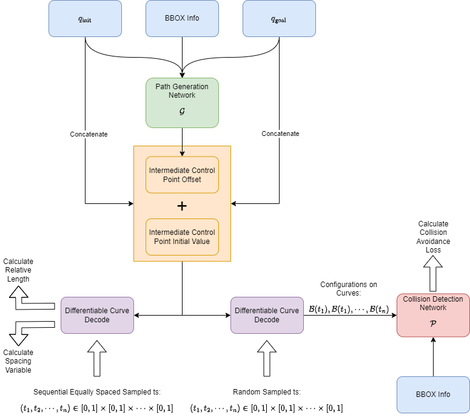

The training architecture looks like a GAN or Actor-Critic architecture. In fact, we can think of it as a GAN with a fixed discriminator, or an Actor-Critic with a fixed critic. The problem is actually a simplified reinforcement learning problem, i.e., an associated, continuous state space multi-armed bandit problem.


In order to ensure that the output values of the path generation network do not have a large number of control points concentrated in a small region due to network weight initialization, a specific strategy is adopted whereby the output of the path generation network does not directly correspond to the control points of the curve, but is an offset with respect to the initial control points. The selection scheme for the initial control points is to sample points equally spaced on a straight line connecting the starting configuration to the goal configuration. This is done by calculating the length of the straight line segment connecting the starting configuration and the goal configuration, and then dividing it equally spaced according to the number of control points, and assigning each division point sequentially to each intermediate control point:

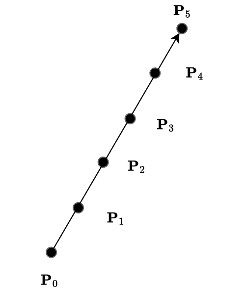

 Since the intermediate control points lie on the same line, all points on the initial Bézier curve also fall on that line. This offset mechanism makes it possible to generate a curve that essentially behaves as a straight line even if the output value of the model is small, avoiding abnormal shapes to the curve.


The loss function used to train $\mathcal{G}$ is as follows:

```math
\begin{aligned}
\mathcal{L} &= \alpha \cdot \mathcal{L}_1 + \beta \cdot \mathcal{L}_2 + \gamma \cdot \mathcal{L}_3 \\
&= \alpha \cdot \frac{1}{MN}\sum_{i=1}^{N}\sum_{j=1}^M -\log{[1 - \mathcal{P}(\mathcal{D}(t_{ij}), \textup{bbox}_i)]} + \\
& \quad \beta \cdot \frac{1}{N}\sum_{i=1}^N \frac{ \sum_{k=1}^{P-1} \|\mathcal{D}(t_{ik+1}) - \mathcal{D}(t_{ik})\|_2 }{\|\mathcal{D}(t_{iP}) - \mathcal{D}(t_{i1})\|_2} + \\
& \quad \gamma \cdot \frac{1}{N(P-1)}\sum_{i=1}^N  \sum_{k=1}^{P-1} [\|\mathcal{D}(t_{ik+1}) - \mathcal{D}(t_{ik})\|_2 - \frac{1}{P-1}\sum_{k=1}^{P-1} \|\mathcal{D}(t_{ik+1}) - \mathcal{D}(t_{ik})\|_2]^2
\end{aligned}
```

During the training of the path generation network, we use two different sampling strategies for the curve parameter $t$, i.e., sequential isospaced sampling and random sampling, which are used to compute different loss function values. The sequential isospaced sampling strategy samples the parameter $t$ from the interval $[0, 1]$ in a sequential and isospaced manner to ensure that the corresponding points on the Bézier curve are ordered. This facilitates the calculation of the lengths of line segments between neighbouring curve points. By accumulating the lengths of the line segments the total length of the curve can be calculated, thus constraining the length of the curve during training. On the other hand, random sampling samples a set of parameters $t$ randomly from the interval $[0, 1]$, which provides a more comprehensive coverage of the points on the curve, and is used to compute the value of the overall collision likelihood function of the curve, keeping the curve away from obstacles. The loss function used in the training process consists of three parts where $\mathcal{L}_1$ represents the negative log-likelihood of the overall collision probability, which is used for obstacle avoidance, $\mathcal{L}_2$ is the relative path length, which is used to constrain the total length of the generated curves, $\mathcal{L}_3$ is the variance about the length of the line segments between neighbouring points in the curves, which is mainly aimed at constraining the spacing between the ordered points to make them more uniform. $\alpha$, $\beta$ and $\gamma$ are the weighting factors used to regulate each loss. $\mathcal{D}(t)$ denotes the output of the differentiable curve decoder at parameter $t$, where the curve control points are omitted, and $\mathcal{P}(\mathcal{D}(t), \textup{bbox}_i)$ denotes the output of the collision detection network $\mathcal{P}$ given input configuration $\mathcal{D}(t)$ and the bbox information. $N$ is the number of curves in the training batch, $M$ is the number of randomly sampled points in each curve, and $P$ is the number of sequentially equally spaced points sampled in each curve.


Path Planned by Path Generation Network:

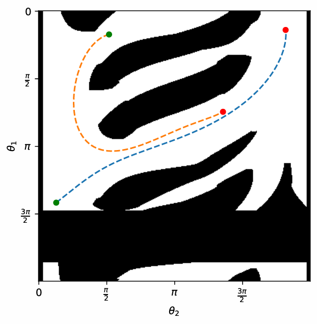

## Usage

Make sure you installed required Python package, e.g., PyTorch, PyQt5 etc.

### Generate Training Data

In `src` folder:

```shell
python3 generate_data.py --num_train_samples 500000 --num_test_samples 50000 --save_path "../data" --min_bbox_width 10 --max_bbox_width 40 --min_bbox_height 10 --max_bbox_height 40
```

After running the script, two `.npy` files generated for training and testing respectively. BBOX size are sampled from two uniform distribution

```math
U \sim [\textup{min\_bbox\_width}, \mathrm{max\_bbox\_width}] \\
\textup{and} \\
U \sim [\mathup{min\_bbox\_height}, \mathup{max\_bbox\_height}]
```

### Train Collision Detection Network

In `src` folder:

```shell
python3 train_collision_detection_network.py --data_folder ../data --log_name collision_detection_network --epochs 100 --gpu_ids 0
```


### Visualize the Network Outputs

In `src` folder:

```shell
python3 visualize.py --ckpt ../run/collision_detection_network/final.pth --gpu_ids 0
```

* --ckpt: the checkpoint file of the network

There are two buttons:

* Evaluate Network Output: generate probability in bbox size plot and probability heat map
* Generate Ground Truth Configuration Space: generate the ground truth configuration space using collision detection algorithm provided by PyQt5

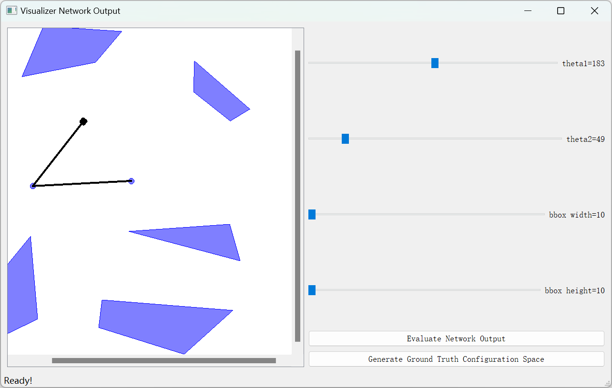


### [Optional] Visualize Collision Avoidance or Curve Optimization

1. Visualize Collison Avoidance

In src folder:

```shell
python3 visualize_collision_avoidance.py --ckpt ../run/collision_detection_network/final.pth --gpu_ids 0
```

2. Visualize Curve Optimization

In src folder:

```shell
python3 visualize_curve_optimization.py --ckpt ../run/collision_detection_network/final.pth --gpu_ids 0
```


### Train Path Generation Network

In `src` folder:

```shell
python3 train_path_generation_network.py --ckpt ../run/collision_detection_network/final.pth --log_name path_generation_network --epochs 100 --gpu_ids 0 --gamma 30
```


### Interactive Demo

In `src` folder:

```shell
python3 app.py --cdn_ckpt ../run/collision_detection_network/final.pth --pgn_ckpt ../run/path_generation_network/final.pth --gpu_ids 0
```

* --cdn_ckpt is the collision detection network checkpoint file
* --pgn_ckpt is the path generation network checkpoint file


***mouse double click in the scene to set the goal pose***

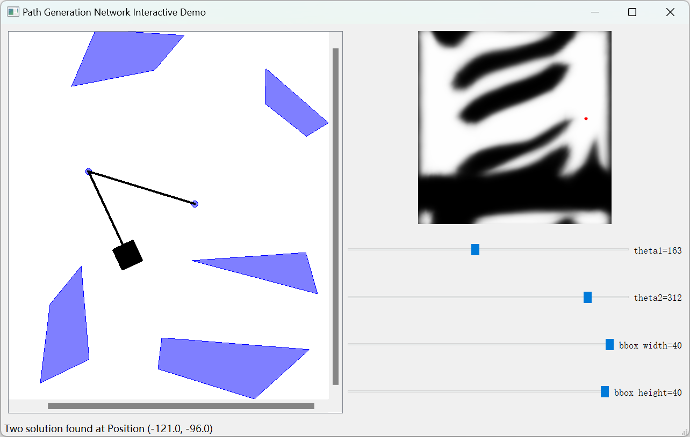


As can be seen, during curve optimization, some curves stuck at local minima are successfully planned by $\mathcal{G}$, while $\mathcal{G}$ fails to plan paths for some simple queries, which may be the result of the need for more training time or extra techniques. Since this is an associated multi-armed bandit problem that requires stochastic exploration to find better paths, it is better to solve this problem using standard reinforcement learning methods, together with the loss function in the repo as an auxiliary task. It is also desirable to have another network to guide the training for the entire curve, not just the points on the curve.


If you use this repo in your research, please cite this repo:

```latex
@misc{Movic2024,
  author = {Movic, Chen},
  title = {Path Generation Network},
  year = {2024},
  publisher = {GitHub},
  journal = {GitHub repository},
  howpublished = {\url{https://github.com/mo-vic/PathGenerationNetwork}}
}
```


For commercial use, contact me first: movic.chen@gmail.com


## Bibliography

[1] Choset H, Lynch K. M, Hutchinson S, et al. Principles of robot motion: theory, algorithms, and implementations[M]. MIT Press, 2005.
